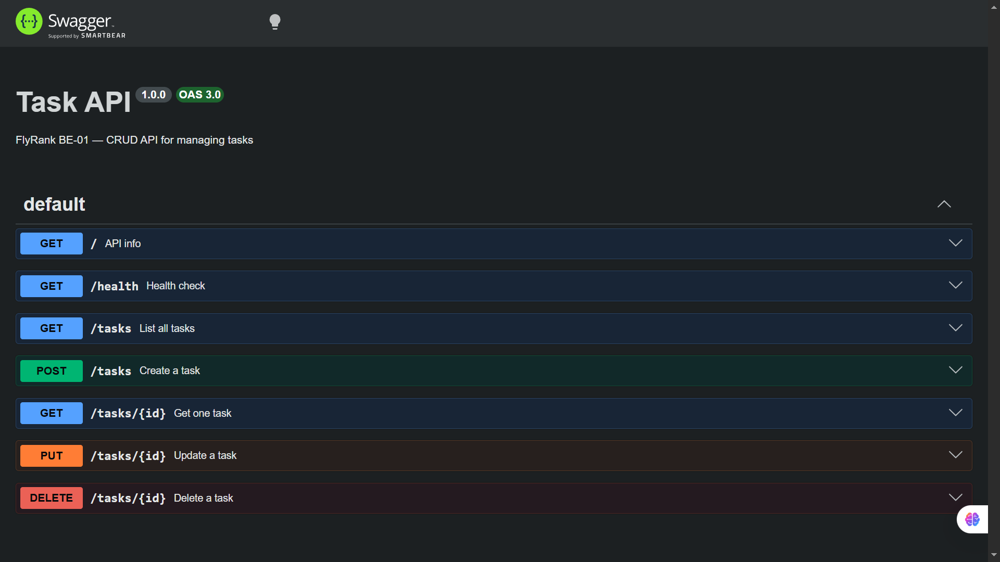

# FlyRank Backend Milestones — BE-01: Task CRUD API

A REST API for managing a to-do list, built with Node.js and Express.
Data lives in memory — restarting the server resets all tasks (this is intentional; BE-04 adds a real database).

## Run it

```bash
npm install
node server.js
```

Server starts at `http://localhost:3000`  
Swagger UI at `http://localhost:3000/docs`

## Endpoints

| Method | Path | Description | Success | Error |
|--------|------|-------------|---------|-------|
| GET | / | API info | 200 | — |
| GET | /health | Health check | 200 | — |
| GET | /tasks | List all tasks | 200 | — |
| GET | /tasks/:id | Get one task | 200 | 404 |
| POST | /tasks | Create a task | 201 | 400 |
| PUT | /tasks/:id | Update a task | 200 | 400, 404 |
| DELETE | /tasks/:id | Delete a task | 204 | 404 |

## Sample curl output
$ curl -i -X POST http://localhost:3000/tasks 
-H "Content-Type: application/json" 
-d '{"title":"Buy milk"}'
HTTP/1.1 201 Created
Content-Type: application/json; charset=utf-8
{"id":4,"title":"Buy milk","done":false}

## Swagger UI



## Notes

- No database yet — data resets on restart. That's the lesson; BE-04 fixes it with Postgres + Docker.
- Service and routes do not know about storage — swapping the data layer next week changes only one file.


## BE-02: SQLite Integration

- Added SQLite database using `better-sqlite3`
- Tasks are persisted across server restarts
- DB file: `tasks.db`
- Manual SQL queries verified via DB Browser for SQLite